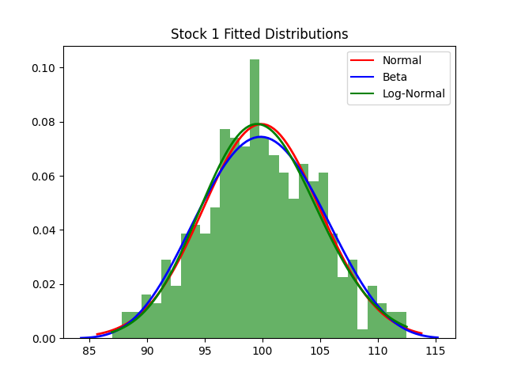
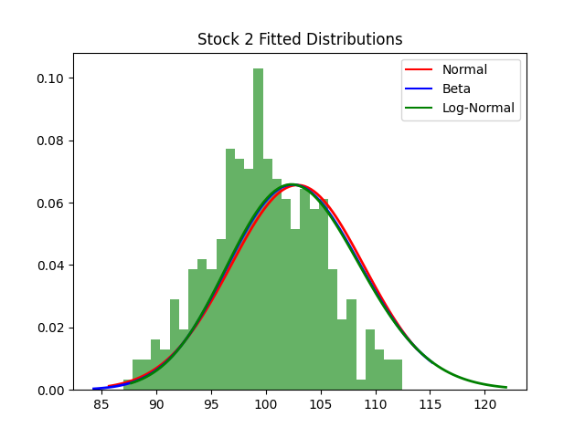

# Options as a Financial Tool

## Team Members:
    - Logan Liddiard
    - Joel Pierson

## Usage

`python main.py`

## Requirements:

    numpy
    matplotlib.pyplot
    pandas
    scipy.stats

These can be installed by running:
```
pip install numpy matplotlib pandas scipy
```

## Part 1: Fitting Stock Data to Distributions

For this part of the assignment we decided to look at three different fitted distributions for each stock. Normal, Beta, and Log Normal.

the following two graphs are the results of placing those fitted distributions over our different stocks data.

<p align="center">
  
</p>

<p align="center">
  
</p>

After viewing the results of these graphs, we want to now see which one is the best using different tests. We decided to go off of two different tests. The KS test and the QQ plot test.

For the KS results we are looking for a low KS value and a high P values.

After running these tests for Stock 1 we found the following results:

    KS test for Normal distribution: Statistic = 0.032171207108126154, p-value = 0.8323264146108397
    KS test for Beta distribution: Statistic = 0.03132652917601397, p-value = 0.8549704316452815
    KS test for Log-Normal distribution: Statistic = 0.02492587286250869, p-value = 0.9729703143576192

As we can see based on these results, the Log-Normal distribution is the best fit for Stock 1. Similiarly on the test for stock 2 as seen below we found the same results.

    KS test for Normal distribution: Statistic = 0.03594149062806773, p-value = 0.7192847965439632
    KS test for Beta distribution: Statistic = 0.027015421384234184, p-value = 0.946071248608926
    KS test for Log-Normal distribution: Statistic = 0.024799557813071804, p-value = 0.9742313417794974

Through the KS test we found that Log-Normal distribution was the best fit overall.

However we wanted to test this with a second method with a QQ plot.

Through this test we want to see which fitted distribution is closest coorelated values to the ideal line (red)

as we see for stock 2 the Log-Norm

This plot agrees with the KS test saying that the Log-Normal fit distribution is the best fit since it is closest to the red line.


<p align="center">
  
</p>

However for stock one. It seems that the beta distribtuion is a better fit with this test as seen below.

<p align="center">
  
</p>

There are a few different explainations for the differences between them. Especially since they are two different tests that have different rules for what defines best fitness. 

## Part 2

    TODO


## Part 3

    TODO