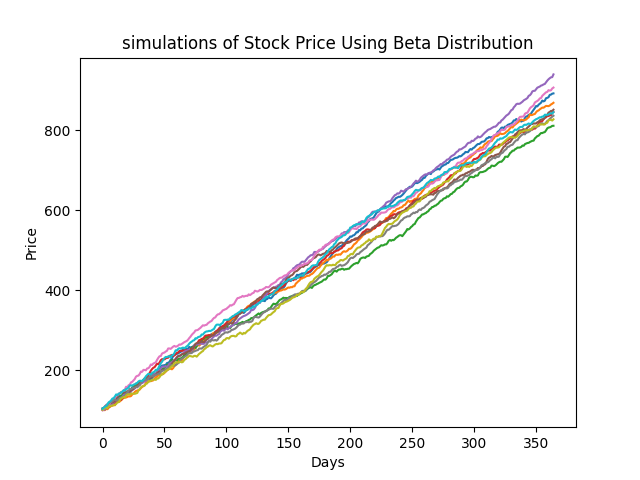
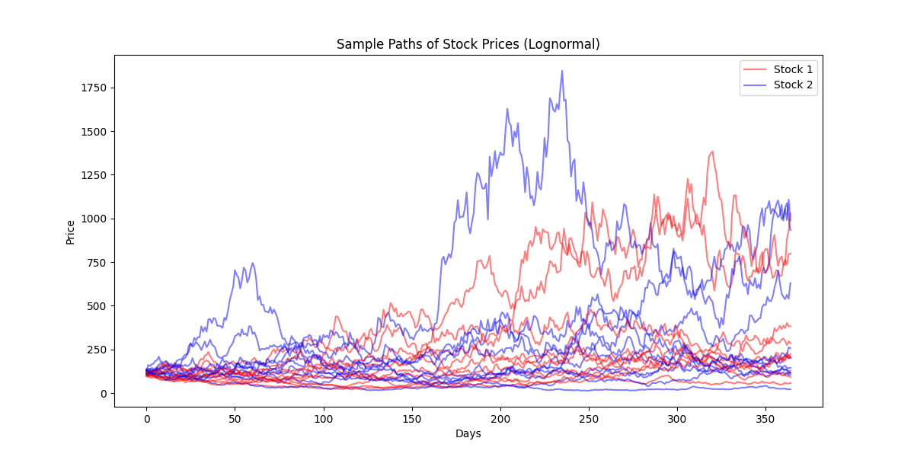

# Options as a Financial Tool

## Team Members:
    - Logan Liddiard
    - Joel Pierson

## Usage

* `python main.py` for running all 3 parts.
* `python best_fit.py` for running part 1.
* `python monte_carlo.py` for running part 2.
* `python part3.py` for running part 3.
## Requirements:

    numpy
    matplotlib.pyplot
    pandas
    scipy.stats

These can be installed by running:
```
pip install numpy matplotlib pandas scipy
```

## Part 1: Fitting Stock Data to Distributions

For this part of the assignment we decided to look at three different fitted distributions for each stock. Normal, Beta, and Log Normal.

the following two graphs are the results of placing those fitted distributions over our different stocks data.

<p align="center">
  
</p>

<p align="center">
  
</p>

After viewing the results of these graphs, we want to now see which one is the best using different tests. We decided to go off of two different tests. The KS test and the QQ plot test.

For the KS results we are looking for a low KS value and a high P values.

After running these tests for Stock 1 we found the following results:

    KS test for Normal distribution: Statistic = 0.032171207108126154, p-value = 0.8323264146108397
    KS test for Beta distribution: Statistic = 0.03132652917601397, p-value = 0.8549704316452815
    KS test for Log-Normal distribution: Statistic = 0.02492587286250869, p-value = 0.9729703143576192

As we can see based on these results, the Log-Normal distribution is the best fit for Stock 1. Similiarly on the test for stock 2 as seen below we found the same results.

    KS test for Normal distribution: Statistic = 0.03594149062806773, p-value = 0.7192847965439632
    KS test for Beta distribution: Statistic = 0.027015421384234184, p-value = 0.946071248608926
    KS test for Log-Normal distribution: Statistic = 0.024799557813071804, p-value = 0.9742313417794974

Through the KS test we found that Log-Normal distribution was the best fit overall.

However we wanted to test this with a second method with a QQ plot.

Through this test we want to see which fitted distribution is closest coorelated values to the ideal line (red)

as we see for stock 2 the Log-Norm

This plot agrees with the KS test saying that the Log-Normal fit distribution is the best fit since it is closest to the red line.


<p align="center">
  
</p>

However for stock one. It seems that the beta distribtuion is a better fit with this test as seen below.

<p align="center">
  
</p>

There are a few different explainations for the differences between them. Especially since they are two different tests that have different rules for what defines best fitness. 

## Part 2: Monte Carlo Simulation for Vanilla European Option Pricing

In this section, we implemented a Monte Carlo simulation to estimate the price of a European option. The assumption was made that the asset would follow a beta distrubtion with further parameters defined by the assignment. We performed 5000 simulations to obtain the price paths. Using these paths, we calculated the payoff at the option's maturity and discounted it to present value using a risk-free rate of 1%.

After running 5000 simulations, we obtained the following results:
```
Average Stock Price at Maturity: $868.77
Estimated European Call Option Price $761.12
```

These results show a strong upward movement in stock price over the simulated year, driven largely by the specific parameters of the Beta distribution (showing a left skewed distribution) and the drift and volatility applied. The high option price suggests that the underlying stock significantly exceeds the strike price, leading to substantial payoffs. I would highly suggest investing in either the stock or European Call Option if this distribution were an accurate portrayal of the stock's future price movements. 

<p align='center'>
  
</p>


## Part 3: Stochastic Jumps and Basket Option Pricing

To model the future price paths of the underlying assets of the basket option, we opted to use the lognormal distribution. This is because both stock 1 and stock 2 were shown to be well-represented by the lognormal distribution, so for simplicity's sake, we chose lognormal for both of them. Here is an example visualization of the price paths:

<p align="center">
  
</p>

We then calculated the option price for two scenarios and compared them.

Scenario 1: The option pays off if it outperforms the average value of stock1 and stock2 at maturity.
Scenario 2: The option pays off if it outperforms the maximum value of either stock1 or stock2 at maturity.

Here is an example output from our program:

    Basket Option Price (Scenario 1 - Outperform Average): $273.29
    Basket Option Price (Scenario 2 - Outperform Maximum): $529.61
    Comparison: Scenario 2 price is 1.94 times Scenario 1 price

